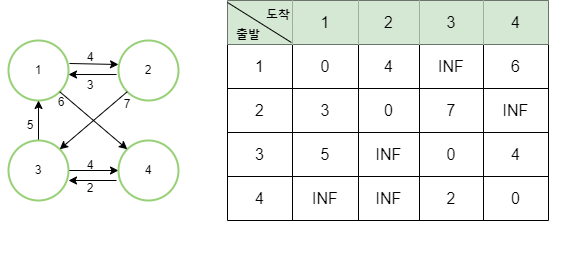
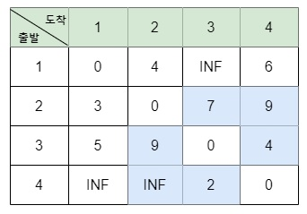
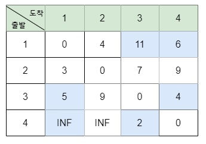
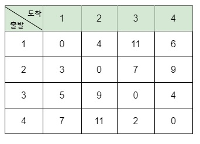

# 🎯 플로이드 워셜 알고리즘

플로이드 워셜 알고리즘은 **음수 순환 사이클이 없는 그래프의**   '모든 노드'에서 다른 모든 노드까지의 최단경로를 모두 계산하는 알고리즘이다.

다익스트라 알고리즘과의 차이점
- 그래프에 음수 사이클만 존재하지 않으면, 음의 가중치를 갖는 간선이 존재해도 상관 없다. 
- 거쳐가는 중간 노드를 기준으로 최단거리를 구한다. 

음수 사이클 : 사이클의 모든 경로를 지나 원래 지점으로 돌아 왔을때, 최종적인 비용이 음수가 되는 경우
 
 

# 플로이드 워셜 알고리즘 동작 과정
각 단계에서는 해당 노드를 거쳐가는 모든 경우를 고려한다.  
k번 노드에 대해서 확인할 때는 k번 노드를 중간에 거쳐 지나가는 모든 경우를 고려하면된다.  이를 점화식으로 표현하면 다음과 같다.

> D(a,b) = min(D(a,b), D(a,k)+D(k,b))

  점화식을 의미하는 내용을 풀어서 설명하면   (a에서 b로 가는 최단거리, a에서 k를 거쳐서 b로 가는 거리)를 비교하여 더 작은 값으로 갱신하겠다는 것이다.  즉, k를 거쳐가는 것이 빠르다면 최단거리 테이블을 갱신하겠다는 의미이다. 
   
   

  ### 1. 초기그래프 설정
  - 각 정점 쌍 사이의 거리 초기값 설정
  - 직접적인 경로가 있는 경우 거리, 경로가 없는 경우 무한대(INF)
- 자기 자신으로의 경로는 0으로 초기화  
</img>

 

### 2. 정점 간 최단 경로 갱신
- 모든 정점을 순차적으로 탐색
-  정점을 거쳐가는 경로가 더 짧은지 확인하고 최단 경로를 갱신
- **3중 반복분**을 사용하여, 
외부 반복문은 거쳐가는 정점, 
 중간 반복문은 출발 정점,  내부 반복문은 도착 정점 확인
 - 점화식
  

 ### 3. 최단 경로 갱신
 현재 정점을 거쳐가는 경로의 길이와 현재까지의 최단 경로를 비교하여 더 짧은 경로가 존재한다면 최단 경로를 갱신

 >점화식
 
 D(2,3) = min(D(2,3), D(2,1)+D(1,3)) = min(7, 3+INF)

D(2,4) = min(D(2,4), D(2,1)+D(1,4)) = min(INF, 3+6)

D(3,2) = min(D(3,2), D(3,1)+D(1,2)) = min(INF, 5+4)

D(3,4) = min(D(3,4), D(3,1)+D(1,4)) = min(4, 5+6)

D(4,2) = min(D(4,2), D(4,1)+D(1,2)) = min(INF, INF+4)

D(4,3) = min(D(4,3), D(4,1)+D(1,3)) = min(2, INF+INF)

 

</img>
> 1번노드

 

</img>
> 2번노드

-> 모든 노드 반복

 

 ### 4. 모든 정점에 대한 최단 경로 탐색
 2번과 3번 단계를 반복하여 최단 경로 파악

 

 ### 5. 결과 출력 
 모든 정점 쌍 사이의 최단 경로가 계산하여 2차원리스트로 저장

 </img>

 
 

# 플로이드 워셜 시간복잡도

시간복잡도 : O(V^3)

공간복잡도 : O(V^2)

> V = 그래프 정점의 수

 
 

# 플로이드 워셜 장단점
장점   
1. 모든 정점 쌍에 대한 최단 경로를 찾을 수 있다.
2. 음의 가중치를 가진 그래프에도 적용 가능하다.
3. 중간 정점을 거쳐가는 경로를 고려할 수 있어,  다른 제약 조건이 있는경우에도 최단경로를 찾을 수 있다.

단점  
1. 시간 복잡도가 크다. O(V^3)
2. 메모리 사용량이 크다. (2차원 배열 거리 저장)
3. 음의 사이클이 있는경우 동작하지 않는다.