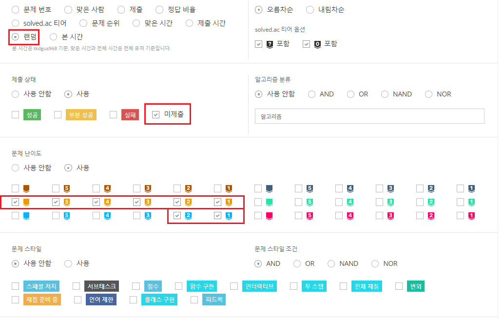

# ✨코딩테스트 대비 문제풀이 저장소

## 언어 
- Java

## 플랫폼 
- 백준
- 프로그래머스

## 풀이 방법
1. 백준 골드(실버1,2) 문제 랜덤으로 지정    
</img>  
2. 문제에서 요구하는 알고리즘 파악   

3. 문제 풀이

> 골드 1 2 ⏰ 90분  
> 골드 3   ⏰ 70분  
> 골드 4 5 ⏰ 50분  
> 실버 1 2 ⏰ 40분  

## 정리
1. 시간 내 못 푼 문제
2. 틀린 문제 
3. 맞춘 문제