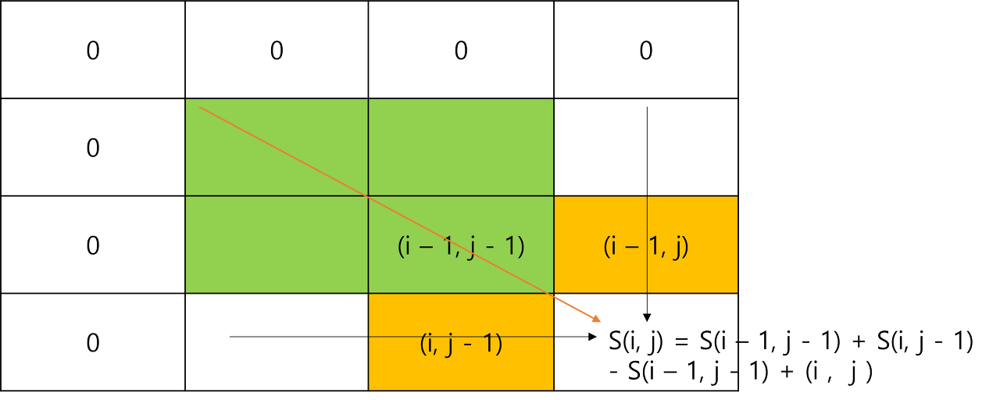
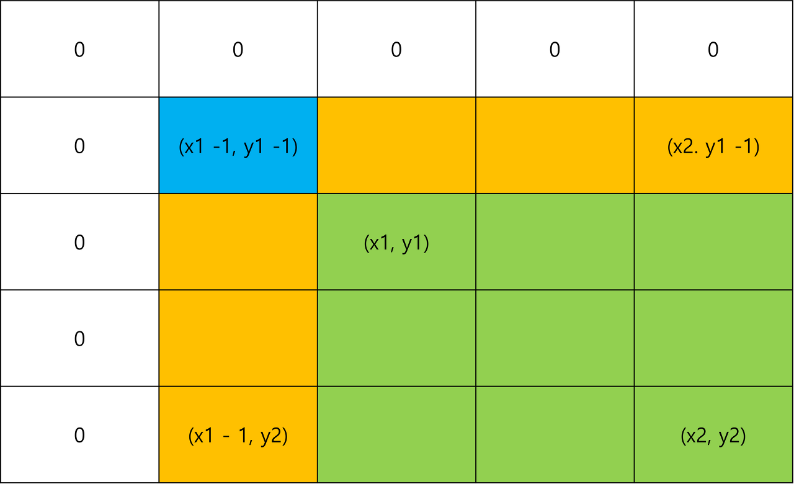

# Prefix 누적합

알고리즘 풀이시 2차원 배열에서 특정 구간의 원소를 일일이 계산하여 코드를 작성하다보니 효율성 테스트에서 시간 초과하는 경우가 생겼다.

시간 복잡도는 미리 합산하여 배열에 저장해 놓는 방법으로 해결할 수 있었고, <br>
그 방법인 `누적합 알고리즘`에 대해서 정리해보려고한다.

<br>

## 이론
누적 합(Prefix Sum)은 주어진 배열에서 특정 구간의 합을 빠르게 계산하기 위한 알고리즘으로,
<br>배열의 요소를 미리 합산하여 누적하여 저장하는 방식으로 사용한다.

이로써 특정 구간의 합을 구할 때 반복문을 사용하여 합을 구하는 것보다 시간복잡도를 단축하여 계산할 수 있다.


구간의 시작부터 끝까지 모든 요소를 반복하여 합을 계산해야 하므로 O(n)의 시간복잡도가 필요하지만 구간 합을 사용하는 경우 O(1) 의 시간복잡도를 가진다.

1차원 배열과 2차원 배열을 확인하며 이해해보자.

<br>

## 1차원 배열
```java
import java.util.Arrays;

public class Main {

    public static void main(String [] args){
        int[] array = {1, 8, 7, 4, 3, 5, 6};
        int[] prefixSum = calculatePrefixSum(array); 
        System.out.println(calculateRangeSum(prefixSum, 2, 4)); 
        // 출력 : 14
    }
			
    public int[] calculatePrefixSum(array) {
        int n = arr.length;
        int[] prefixSum = new int[n];
        prefixSum[0] = arr[0];

        for (int i = 1; i < n; i++) {
            prefixSum[i] = prefixSum[i - 1] + arr[i];
        }

        return prefixSum;
    }

    public int calculateRangeSum(int[] prefixSum, int l, int r) {
        if (l == 0) {
            return prefixSum[r];
        } else {
            return prefixSum[r] - prefixSum[l - 1];
        }
    }


}
```

위 코드와 같이 누적합 배열을 사용하면 특정 구간에서  O(1)의 시간복잡도를 가질 수 있다. 

> prefixSum 의 인덱스 초과를 방지하기위해 prefixSum[0] = arr[0] 선언을 해야한다.

<br>

## 2차원 배열
```java
import java.util.Arrays;

public class Main {

    public static void main(String[] args) {
        int[][] matrix = {{1, 2, 3, 4}, {5, 6, 7, 8}, {9, 10, 11, 12}, {13, 14, 15, 16}};

        int[][] prefixSum = calculatePrefixSum(matrix);
        System.out.println(calculateRangeSum(prefixSum, 1, 1, 2, 2));

    }

    public static int[][] calculatePrefixSum(int[][] matrix) {
        int rows = matrix.length;
        int cols = matrix[0].length;
        int[][] prefixSum = new int[rows+1][cols+1];

        // 첫 행과 첫 열의 누적 합 계산
        prefixSum[0][0] = matrix[0][0];
        // 행
        for (int i = 1; i <= rows; i++) {
            prefixSum[i][0] = prefixSum[i - 1][0] + matrix[i-1][0];
        }
        // 열
        for (int j = 1; j <= cols; j++) {
            prefixSum[0][j] = prefixSum[0][j - 1] + matrix[0][j-1];
        }

        // 나머지 부분의 누적 합 계산
        for (int i = 1; i <= rows; i++) {
            for (int j = 1; j <= cols; j++) {
                prefixSum[i][j] = matrix[i-1][j-1] + prefixSum[i - 1][j] + prefixSum[i][j - 1] - prefixSum[i - 1][j - 1];
            }
        }

        return prefixSum;
    }

    public static int calculateRangeSum(int[][] prefixSum, int row1, int col1, int row2, int col2) {
        int totalSum = prefixSum[row2][col2];
        int upperSum = (row1 > 0) ? prefixSum[row1 - 1][col2] : 0;
        int leftSum = (col1 > 0) ? prefixSum[row2][col1 - 1] : 0;
        int overlapSum = (row1 > 0 && col1 > 0) ? prefixSum[row1 - 1][col1 - 1] : 0;

        return totalSum - upperSum - leftSum + overlapSum;
    }

}
```

> calculatePrefixSum() 구간합
<p align="center">
 </img>
 </p>

행과 열의 합을 계산하여 누적 합을 저장해 둘 2차원 배열을 리턴해준다.

<br>

> calculateRangeSum() 
<p align="center">
 </img>
 </p>

 위 그림은 **calculateRangeSum()** 함수를 그림으로 나타낸 표현이다. <br> 주황색은 공통된 영역이며, 공통된 영역인 (x1 - 1, y2)와 (x2, y1 -1)의 누적합을  빼주면 된다.

하지만 (x1 -1, y1 - 1)만 파란색으로 했다. <br> 그 이유는 (x1 - 1, y2)와 (x2, y1 -1)의 누적합한 부분이 (x1 -1, y - 1) 공통으로 들어있어서 2번을 빼는 경우가 생긴다. 그래서 파란색 영역을 다시 더해줘야 (x1, y1), (x2, y2)의 공통영역을 제거 할 수가 있다. 

이를 통해 2차원 배열의 임의의 부분 구간 내의 합을 빠르게 계산할 수  있다.

<br>

## reference
[구간합, 누적합(prefix sum)](https://jih3508.tistory.com/50)