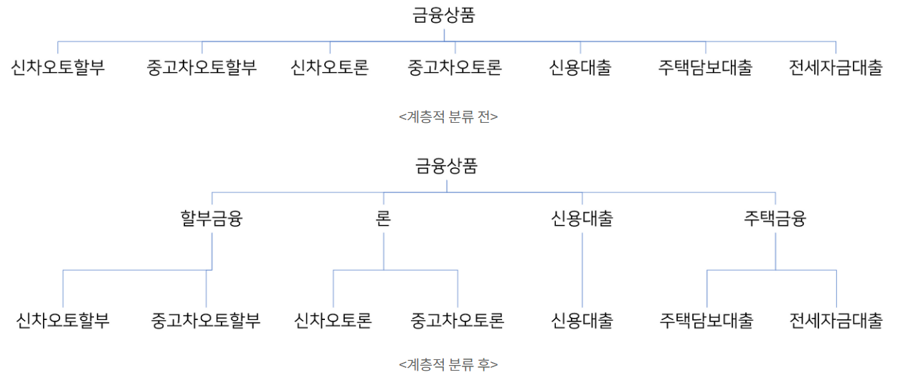

# 인스턴스 변수를 줄여야하는 이유

## 인스턴스 변수란?  
클래스가 있는 객체 지향 프로그래밍에서 인스턴스 변수는 클래스에 정의된 변수로  
이를 위해 각각의 인스턴스화된 클래스의 객체가 별도의 사본이나 인스턴스를 가지고 있다.

자신만의 인스턴스 변수 즉 사본을 가지고있으므로,  
인스턴스 변수들은 메소드가 정적으로 선언되어 있지 않은 경우  
`모든 클래스 메소드`들에 의해 사용될 수 있다.

즉, 외부클래스에서 접근할 수 있도록 제어하며,  
 메서드 호출이 끝나더라도 객체의 필드는 계속해서 존재하고,  
  다음 메서드 호출에서 이전 상태를 유지하여 재사용성도 높다.

**여기서 인스턴스 변수를 줄여야 하는 이유는 무엇일까?**  
인스턴스의 '수' 를 줄이라는 말은  
 클래스는 계층적인 분류로 설계해야 한다는 말과 같다. 

 

</img>

`클래스가 한 가지 책임만을 갖도록 설계`되고 `불필요한 상태를 갖지 않도록 하면`, 
해당 클래스의 인스턴스 수를 줄이는 효과가 있기 때문이다.

또한 `Effective Java` 책에서는 인스턴스 변수와 관련된 가이드라인을 제시해주고 있었다.

 

### **캡슐화를 강화하라**
클래스의 상태를 캡슐화하고 외부에서 직접적인 접근을 피하는 것이 좋다 
- 클래스 내부 구현을 자유롭게 변경할 수 있으며, 불변성과 불변 객체를 유지하기 쉬워진다.

### **불변성을 지향하라**

인스턴스 변수를 불변으로 만들면 해당 객체의 상태가 변경되지 않으므로 예측 가능하고 안정적인 동작이 가능하다. 
- 불변 객체는 보다 안전하게 공유될 것이다.

### **클래스의 크기를 작게 유지하라**
클래스가 많은 인스턴스 변수를 가지게 되면 클래스의 복잡성이 증가하고 이해하기 어려워진다. 
- 작은 크기의 클래스는 이해하기 쉽고, 재사용 및 유지보수가 간편하기 때문이다.

### **의존성을 낮추어라**
다른 클래스에 대한 의존성을 낮추는 것이 좋다.
-  즉, 클래스가 다른 클래스의 세부 구현에 강하게 의존하지 않도록 설계하는 것이 중요하다.

이러한 원칙은 객체지향 설계의 핵심 원칙 중 하나인 SOLID 원칙과도 관련이 있다. 

인스턴스 변수를 적절히 활용하여 객체를 설계하면 유지보수성이 높아지고 코드의 이해도가 증가하게 된다.  
따라서 클래스의 역할과 책임을 명확히 정의하고, 필요한 데이터만을 인스턴스 변수로 포함시키는 것이 중요하다.

 

## **어디까지 줄일 수 있을까? (직접생성 vs 외부주입) DI 측면**

나는 추가로 DI를 사용하지않고 직접 생성하는 (InputView, OutPutView)를 사용했었는데(인스턴스 변수 x)  
DI를 사용하여 인스턴스 변수를 추가하는 방식
두 가지 방식을 비교하고  
어디까지 줄일 수 있는지 궁금해져서 표로 분리해보았다.

| 측면             | 직접 생성(DI 미 사용) 인스턴스 X                                          | 외부 주입(DI 사용) 인스턴스 변수 O                                        |
|------------------|-----------------------------------------------------------------|-------------------------------------------------------------|
| 의존성 관리       | 의존성은 클래스 내부에서 인스턴스 변수를 통해 관리       | 의존성은 외부에서 주입되어 클래스 내부를 수정하지 않고도 더 좋은 제어와 유연성을 제공                    |
| 유연성            | 유연성이 낮다. 의존성을 변경하려면 클래스를 직접 수정 | 유연성이 높음. 의존성을 쉽게 교체하거나 외부에서 구성할 수 있어 클래스를 수정하지 않고도 설정이 가능하다  |
| 테스트 용이성    | 테스트하기 어려울 수  의존성이 클래스와 강하게 결합 | 테스트하기 쉬워진다. 의존성은 쉽게 목업이나 대체 구현체로 교체할 수 있다                              |
| 캡슐화           | 의존성은 클래스 내에서 캡슐화되어 있어 응집도가 높을 수 있다  | 의존성이 명시적으로 전달되므로 캡슐화는 낮아지지만 결합도는 낮아진다                                 |
| 초기화 부담      | 의존성은 주로 클래스 생성자나 메서드 내에서 초기화           | 의존성은 외부에서 초기화되고 객체 생성 중에 주입될 수 있다                                           |
| 가독성           | 클래스는 모든 의존성 정보를 한 곳에 포함하고 있다               | 의존성과 그 구성은 외부에 있으므로 별도로 확인이 필요하다                                           |

프로젝트의 규모, 팀의 개발 스타일, 코드의 목적 등에 따라 DI를 적용할 지 말 지를 결정할 수 있지만 의존성 주입의 이점이 더 크다는 것을 표로 확인할 수 있었다.

 

## 정리
인스턴스 변수를 줄이는 작업을 하다보니 클래스에 대한 의존성을 낮추도록 설계하는 부분이 더 중요해 진 것 같다.   

즉, 클래스가 다른 클래스의 세부 구현에 강하게 의존하지 않도록 설계하는 것이 중요하며 객체지향 설계의 핵심 원칙 중 하나인 SOLID 원칙과도 관련이 있어 더 공부해보아야 할 것 같다.

## reference
[객체지향 생활체조 원칙] 규칙 7. 2개 이상의 인스턴스 변수를 가진 클래스를 쓰지 않는다](htps://limdingdong.tistory.com/13)
