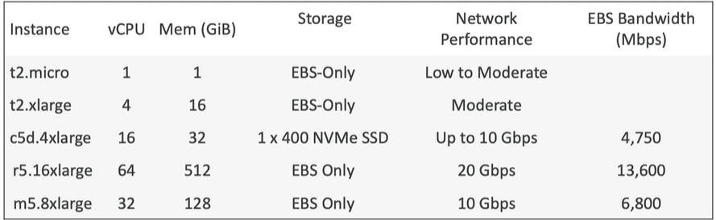

# AWS Certified Developer - Associate

# EC2 basic

## Amazon EC2
1. EC2

(OS) : Linux, Windows or Mac OS

(CPU) : compute & cores

(RAM) : random-access memory

(Storage space)  
Netwrok-attached : (EBS & EFS)
Hardware : (EC2 Instance Store)

(Network card) : Public IP Address

(Security group) : Firewall rules

(`Bootstrap script`) : EC2 User Data

> Bootstrap script : 

 </img>
 

2. EBS
3. ELB
4. ASG

##

