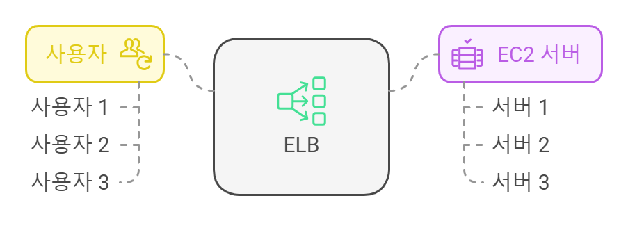

# AWS Basic - ELB + ASG 

## 고가용성과 확장성

###  수직 확장성
- 인스턴스의 크기 확장
    - tc2.micro -> t2.large 
- 데이터베이스와 같이 분산되지 않은 시스템에서 사용
    - RDS, ElasticCache

`하드웨어 한계 제한`

### 수평 확장성(탄력성)
- 인스턴스나 시스템의 수 확장
    - 새로운 ec2 -> tc2.micro 
- 분산 시스템

### 고 가용성
데이터 센터에서의 손실 방지

## 일래스틱 로드 밸런싱(ELB) 
### 개요
로드 밸런서는 서버 혹은 서버셋으로 트래픽을 백엔드나 다운스트림 EC2 인스턴스 또는 서버들로 전달하는 역할

 </img>
 

### 로그밸런싱 역할
- 부하를 다수의 다운스트림 인스턴스로 분산
- 애플리케이션에 단일 액세스 지점(DNS)을 노출 
방지
- 다운스트림 인스턴스의 장애를 원활히 처리
    - 로드 밸런서가 상태 확인 메커니즘으로
어떤 인스턴스로 트래픽을 보낼 수 없는지 확인
- SSL 종료도 할 수 있으니 웹 사이트에 암호화된 HTTPS 트래픽 가짐
- 쿠키로 고정도를 강화할 수 있고 영역에 걸친 고가용성
- 클라우드 내에서 개인 트래픽과 공공 트래픽을 분리

`일래스틱 로드밸런서 = 관리형 로드 밸런서`

### health checks

일래스틱 로드 밸런서 (Health checks)
-> 
EC2 Instance 
- Protocol: HTTP
- Port: 4567
- EndPoint: /health 
    - 200 (OK)

### AWS 로드밸런서 네 종류
**클래식 로드 밸런서, 2009 - CLB**
- http, https, tcp, ssl (secure tcp) aws에서 이제 권장 x

**애플리케이션 로드 밸런서, 2016 - ALB**
- http, https, websocket

7계층, HTTP 전용 로드 밸런서

대상 그룹에 따른 라우팅

url 대상 경로에 기반한 라우팅 가능
- example.com/`users` & example.com/`posts`
- `one`.example.com & `other`.example.com

Docker와 Amazon ECS의 경우 ALB와 가장 적합한 로드 밸런서
> ECS 인스턴스의 동적 포트로의 리다이렉션

하나만으로 다수의 애플리케이션을 사용할 수 있음

**네트워크 로드 밸런서, 2017 - NLB**
- tcp, tls (secure TCP), UDP

**게이트웨이 로드 밸런서, 2020 - GWLB**
- 3계층 , IP Protocol

