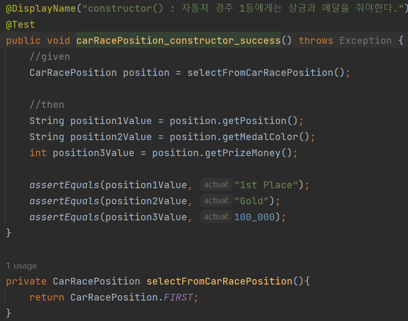
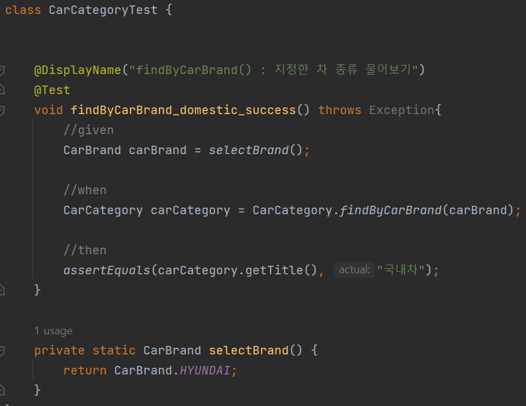

# Java Enum 어떻게 활용해야할까

토이프로젝트를 진행하며 Java Enum을 사용하게 되었다.

여기서 Java Enum을 알고있다고 생각했지만, <br>
실제 코드로 활용하는 것에 있어서 많은 어려움이 있었다.

Java Enum은 어떻게 활용해야할까?

Java Enum을 정리하고 Enum의 장점을 코드로 살펴보자.

<br>

## **Java Enum 이란?**
자바에서는 final로 <br>
 String과 같은 문자열이나 숫자들을 나타내는 기본 자료형의 값을 고정할 수 있다.

이렇게 고정된 값을 상수라고하며 열거형 상수인 Enum 은 서로 연관된 상수들이 집합이다.

<br>

상수들의 집합 Enum을 사용할 때 내가 사용한 장점은 다음과 같다.
- 안전한 타입과 열거 상수를 제공하여 오류를 방지한다.
- 코드가 단순해지며 가독성이 좋다.
- 유지 관리가 쉬워진다.

해당 장점들을 가지고 Enum을 사용하였지만, <br>
Java Enum은 더 많은 장점을 가지고 있다. <br>

이해를 돕기위해 하나씩 코드를 작성하여 정리해보자.

<br>

## **데이터들 간의 연관관계 표현**
Enum을 사용하면 데이터 간의 연관관계를 명확하게 표현할 수 있다. 

자동차 경주의 추가 요구사항으로 1,2,3등에게 상금과 메달을 줘야한다는 요구사항이 생겼다. <br>
여기서 이들의 연관관계를 Enum을 사용하면 간단하게 표현할수 있을 것이다.

```java
public enum CarRacePosition {
    FIRST("1st Place", "Gold", 100_000),
    SECOND("2nd Place", "Silver", 50_000),
    THIRD("3rd Place", "Bronze", 30_000),
    DISQUALIFIED("Disqualified", "None", 0);

    private final String position;
    private final String medalColor;
    private final int prizeMoney;

    CarRacePosition(String position, String medalColor, int prizeMoney) {
        this.position = position;
        this.medalColor = medalColor;
        this.prizeMoney = prizeMoney;
    }

    public String getPosition() {
        return position;
    }

    public String getMedalColor() {
        return medalColor;
    }

    public int getPrizeMoney() {
        return prizeMoney;
    }
}
```

<p align="center">
 </img>
 </p>

각 등수에 따른 상금 정보도 함께 출력할 수 있으며, <br> 이러한 방식으로 등수, 메달 색상, 상금 등 여러 속성을 편리하게 다룰 수 있게 된다.

<br>

## **상태와 행위를 한곳에서 관리**
Enum 내부에 메소드를 추가하여 상태와 행위를 한 곳에서 효과적으로 관리할 수 있다. 

예를 들어, 국내차와 외제차에 대한 세금 부과 로직을 추가하는 경우를 살펴보자

```java
public enum TaxRate {
    A_DOMESTIC_CAR(value -> value * 0.1),
    B_FOREIGN_CAR(value -> value * 0.2),
    CALC_ETC(value -> value * 1.0);

    private Function<Long, Double> expression;

    TaxRate(Function<Long, Double> expression) {
        this.expression = expression;
    }

    public double calculate(long value){
        return expression.apply(value);
    }
}
```

이처럼 Code가 본인만의 계산식을 가지며
**(행위)** <br> 값 **(상태)** 을 다른 곳에서 찾을 필요 없이 값을 표현할 수 있다.

따라서 세금 부과 로직을 관리할 수 있을 것이다.

<br>

## **데이터 그룹 관리**
레이싱 경주 게임이 확장되어 차의 브랜드를 알리기위해 <br>
 국내 자동차 브랜드를 그룹화한다고 가정해보자.

자동차 카테고리 요구사항이 추가되어, <br>
데이터를 국내차와 외제차를 기준으로 세부 기능을 추가해야한다면 <br> 다음과 같이 예시를 들 수 있을 것 같다.

```java
public enum CarBrand {
    HYUNDAI("현대자동차"),
    KIA("기아자동차"),
    SSANGYONG("쌍용자동차"),
    BMW("BMW"),
    MERCEDES("벤츠"),
    JAGUAR("재규어");

    private final String title;

    CarBrand(String title) {
        this.title = title;
    }

    public String getTitle() {
        return title;
    }

}
```

```java
public enum CarCategory {
    DOMESTIC_CAR("국내차",Arrays.asList(CarBrand.HYUNDAI, CarBrand.KIA, CarBrand.SSANGYONG)),
    FOREIGN_CAR("외제차",Arrays.asList(CarBrand.BMW, CarBrand.MERCEDES, CarBrand.JAGUAR)),
    EMPTY("없음", Collections.EMPTY_LIST);

    private final String title;
    private final List<CarBrand> carBrands;

    CarCategory(String title, List<CarBrand> carBrands) {
        this.title = title;
        this.carBrands = carBrands;
    }

    public List<CarBrand> getCarBrands() {
        return carBrands;
    }

    public String getTitle() {
        return title;
    }

    public static CarCategory findByCarBrand(CarBrand carBrand){
        return
                //CarCategory의 Enum 상수들을 순회하며
                Arrays.stream(CarCategory.values())
                        //CarBrand를 갖고 있는게 있는지 확인합니다.
                        .filter(carCategory -> carCategory.hasCarBrand(carBrand))
                        .findAny()
                        .orElse(EMPTY);
    }

    public boolean hasCarBrand(CarBrand carBrand){
        return carBrands.stream()
                .anyMatch(car -> car == carBrand);
    }

    public void applyAdditionalTax() {
        // 국내차에 대한 추가 세금 로직
    }
}
```

Java의 Enum은 결국 클래스인 점을 이용하여, <br>
Enum의 상수에 자동차 브랜드 문자열 리스트를 갖도록 한다. 

Enum 상수들은 본인들이 갖고 있는 인자값들을 확인하여,
<br> 어느 Enum 상수에 포함되어있는지 확인할 수 있게 만들 수 있다.

<p align="center">
 </img>
 </p>

 Enum을 사용하면 <br>
 CarBrand로 데이터를 받아 CarCatgory 관련된 처리,  <br>
즉 국내차와 외제차의 세부 기능을 효과적으로 추가할 수 있다.

<br>

## **정리**
Enum의 다양한 장점들을 살펴보면서 <br>
A값과 B값이 실제로는 동일한 것인지, <br>
이 코드를 사용하기 위해 추가로 필요한 메소드들은 무엇이고, <br> 변경되면 어디까지 변경해야하는 것인지에 대한 데이터 그룹 관리 부분 등 <br>
분리 하는 것에 대한 고민을 도와주며 더 명확하게 나누며 관리할 수 있다는 장점을 확인하였다.

 특히 Java Enum 클래스의 장점으로 상태와 행위를 한곳에서 관리한다는 점과 데이터 관리와 코드의 안정성과 가독성을 높이는 점을 참고하여 사용하면 유지보수성이 크게 높아질 것이다.