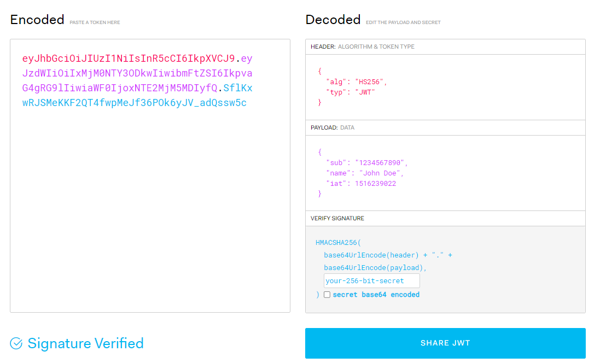

# JWT (JSON Web Token)
## 등장배경 및 장점

- 분산 환경
    - JWT는 서버의 상태를 필요로하지 않다.
- 마이크로서비스 아키텍처
    - JWT는 토큰 기반으로 인증을 처리하기 때문에 각 서비스가 독립적으로 토큰을 검증할 수 있어 마이크로서비스 아키텍처에 적합하다.
- 클라이언트와의 상호 운용성
    - JWT는 JSON 형식을 사용하고, Base64 인코딩을 통해 URL-safe한 문자열로 표현된다. 이는 다양한 플랫폼과 언어에서 사용하기 쉽고, 클라이언트와 서버 간의 상호 운용성을 높인다.

- 클레임 기반 권한 제어
    - JWT는 클레임(Claims)이라는 정보를 토큰에 포함시킬 수 있다.
    - 토큰 자체에 사용자 정보와 권한 등을 포함시킬 수 있다. 
    - 권한 조회나 사용자 정보 조회를 최소화하여 효율적인 권한 제어를 할 수 있다.
- 무상태(Stateless)한 특성
    - 서버의 부담을 줄여줄 뿐 아니라, API 서버의 확장성을 높여줍니다.

이러한 장점들은 RESTful api기반 로그인 로직을 간편하게 구현 할수 있다. 
현재 jwt로 회원가입을 기능을 구현하였고, jwt에 대해서 정리해보기로 하였다.

 

## JWT란?
Json Web Token의 약자로 '웹에서 사용되는 Json 형식의 토큰'이다.   토큰에는 사용자의 권한 및 기본 정보, 서명 알고리즘 등이 포함되어 있다.

JWT는 한번 쓰여진 원본 내용이 유지되었는지 확인할 수 있는 특징이 있기 때문에 이를 활용하여 변경이 되지 않았음을 보장할 수 있다는 장점이 있다.  
또한 서버에 저장되지 않고 클라이언트에서 저장하기 때문에 서버의 메모리 부담을 덜 수 있다. 

 

## JWT를 인증 및 인가에 활용하는 이유.
- JWT는 원본 내용의 유지를 보장할 수 있다.
- 인증된 유저를 정의할 값과 인가에 활용될 권한을 유저에게 전송하는 데에 쓸 수 있고 이는 위변조가 불가능하다.
- 서버 내 Session에 로그인 인증 정보를 저장하고 sessionId를 Client에게 보내주는 방식과 다르게 JWT 자체에 인증, 인가와 관련된 정보를 저장할 수 있기 때문에 서버를 Stateless하게 설계하는데에 도움을 줄 수 있다는 큰 장점이 있다.

 

## 구체적인 JWT의 구조
기본적으로 JWT는 Header.Payload.Signature가 연달아 있는 구조로 각 부분의 온점(.)으로 구분되며,   이는 Base64url를 통해 인코딩 되어 표현된다.

JWT의 내용은 인코딩 되는 것이지 모든 내용이 암호화 되는 것이 아니기 때문에 누구나 읽을 수 있다는 생각을 가지고 민감한 정보는 절대 포함해서는 안된다.

</img>  
위 사진은 jwt.io 사이트에서 인코딩 디코딩 데이터를 확인할 수 있는 사이트이다.

- Header에는 토큰의 유형과 서명 알고리즘, (빨간색)
- Payload에는 권한 및 기본 정보 (보라색) 
- Signature에는 Header와 Payload를 Base64로 인코딩 (하늘색) 

이 후, Header에 명시된 해시 함수를 적용하고 개인키로 서명한 값(전자서명)이 담겨있다.   

위 사이트 처럼 토큰의 인가정보(payload)의 권한 정보를 임의로 바꾼다해도  
이 Signature를 통해 토큰에 대한 위변조 여부를 체크함으로써
위변조된 토큰임을 확인할 수 있다.

 

## AcessToken 과 RefreshToken
JWT를 Access Token과 Refresh Token으로 분리하는 이유는  보안과 효율성 측면에서 이점을 제공하기 때문이다. 

일반적으로 사용되는 인증 방식인 OAuth 2.0에서 사용되는 패턴 중 하나이며, 하나씩 살펴보자. 
### Access Token
- 클라이언트가 API 엔드포인트에 접근할 때 사용되는 토큰이다.
- Access Token은 짧은 유효 기간을 가지며, 클라이언트가 API 호출 시 사용된다
- Access Token은 보안적으로 취약한 환경인 네트워크를 통해 전송되므로, 유효 기간이 짧은 경우 탈취당하더라도 토큰이 길게 유지되지 않아 악용의 위험이 줄어들수있다.

### RefreshToken
- Refresh Token은 Access Token의 만료 시점에 대한 갱신을 위해 사용되는 토큰이다.
-  Refresh Token은 일반적으로 Access Token보다 더 긴 유효 기간을 가지며, 서버 측에 안전하게 저장된다. 
- Refresh Token은 네트워크를 통해 전송되지 않기 때문에, 악의적인 공격자가 탈취하여도 토큰을 사용할 수 없다.
- 필요할 때마다 Refresh Token을 사용하여 새로운 Access Token을 발급받을 수 있다.

분리된 Access Token과 Refresh Token의 사용은 보안 측면에서 Access Token의 유효 기간을 제한하고, 효율성 측면에서 필요할 때마다 Refresh Token을 사용하여 새로운 Access Token을 발급받을 수 있도록 해준다.