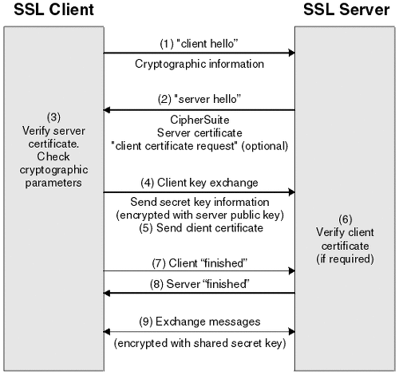

# SSL-TLS-HTTPS 정리

## SSL-TLS 와 HTTPS

SSL (Secure Sockets Layer)과 TLS (Transport Layer Security)는 인터넷을 통한 데이터의 안전한 전송을 보장하기 위해 설계된 암호화 프로토콜이다.

SSL은 원래 Netscape에 의해 개발되었고, <br> TLS는 그 후속으로 IETF(Internet Engineering Task Force)에 의해 표준화되었다. 


TLS는 전송계층(Transport Layer)의 암호화 방식이기 때문에 HTTP뿐만 아니라 FTP, XMPP등 
응용 계층(Application Layer)프로토콜의 종류에 상관없이 사용할 수 있다는 장점이 있으며 기본적
으로 인증(Authentication), 암호화(Encryption), 무결성(Integrity)을 지원한다.

<br>

<p align="center">
 </img>
 </p>

SSL에서 TLS로 이름이 변경된 지 오래됐지만 아직도 사람들은 TLS대신 SSL이라는 표현을 더 많이 <br>
사용하고 있으며 실제로 SSL/TLS의 오픈소스 구현체 프로젝트의 명칭은 아직도 OpenSSL이기도 합니다. 

또한 SSL/TLS의 가장 주된 적용 대상이 HTTPS다 보니 SSL/TLS를 HTTPS와 혼용하는 경우도 많습니다. 


SSL/TLS 를 사용하면 중간자 공격 과 Packet Spoofing 을 통한 도감청을 막을 수 있으며 통신하는 상대방이 맞는지 인증할 수 있다.

<br>

## TLS HandShake

SSL/TLS 세션은 다음 핸드셰이크 과정을 거친 후에 구축된다.


1. 서버는 서버가 사용하는 SSL/TLS 인증서를 전달 (3, 4)

1. 클라이언트는 암호화 통신에 사용할 대칭키를 생성하고 사이를 서버에 전달(5). 이 과정을 키 교환(Key Exchange) 라고 하며 디피-헬만 키 교환(Diffie–Hellman key exchange) 또는 RSA 를 많이 사용. 

1. 클라이언트는 암호화 통신에 사용 가능한 암호 알고리즘과 해시 알고리즘 목록을 서버에 전달. (6, 7)

1. 서버도 알고리즘 목록을 교환후 핸드셰이크가 종료되며 이제 클라이언트와 서버는 암호화 통신에 필요한 대칭키를 서로 보유.(8, 9)

이 과정으로 안전한 연결을 설정할 수 있고 <br>
이를 정리하자면 위 과정은 다음과 같이 정리할 수 있다. <br>
<br>
**클라이언트와 서버 인증**: 서버는 클라이언트에게 자신의 공개키가 포함된 인증서 보냄 <br>
**암호화된 세션 설정**: 클라이언트와 서버는 세션을 암호화하는 데 사용될 비밀키를 협상 <br>
**데이터 전송의 시작**: 안전한 채널이 설정되면, 암호화된 데이터가 클라이언트와 서버 간에 전송

<br>

## TLS 버전별 주요 특이점
| 버전    | 출시 연도 | 주요 특이점                                                                                                     |
|---------|-----------|---------------------------------------------------------------------------------------------------------------|
| TLS 1.0 | 1999      | SSL 3.0에서 발전, 일부 알고리즘 강화, 오늘날에는 취약점으로 인해 권장되지 않음.                                   |
| TLS 1.1 | 2006      | CBC 보호 메커니즘 강화, 패딩 오류를 처리하는 방식 개선, 초기화 벡터(IV) 처리 변경.                              |
| TLS 1.2 | 2008      | SHA-256과 같은 강력한 해시 알고리즘 도입, AEAD(Authenticated Encryption with Associated Data) 암호 지원 추가. |
| TLS 1.3 | 2018      | 핸드쉐이크 과정 단순화, 더 빠른 연결 시간, Forward Secrecy 지원, 오래된 암호화 알고리즘 제거, 향상된 보안 제공.  |

<br>

## 진단방법
외부(인터넷망)에서 사용하는 경우
https://www.ssllabs.com/ssltest/ 로 SSL, TLS의 버전과 인증서, TLS버전별 취약점과 전자기기 지원의 여부 까지 간단하게 확인할 수 있지만,

내부에서 사용하는 경우 URL를 통한 작업이 불가능하기 때문에 OpenSSL을 설치해서 확인할 수 있다.

### **OpenSSL**
OpenSSL은 Eric A. Young과 Tim Hudson이 만든 SSLeay에 기반을 두고 있으며 거의 모든 버전의 UNIX 계열 운영 체제(리눅스, 맥 OS X, 솔라리스, BSD 등) 및 OpenVMS, Windows에서 이용할 수 있다.
 

OpenSSL은 TLS(Transport Layer Security)와 SSL(Secure Sockets Layer)의 프로토콜을 위한 다양한 기능을 갖춘 오픈소스 툴킷으로(C 언어로 작성) 중심 라이브러리 안에는

기본적인 암호화 기능 및 여러 유틸리티 함수들이 구현이 되어있다.

다음 openssl 명령어를 사용하면 현재 tls 의 자세한 정보를 확인할 수 있따.

```bash
openssl s_client -connect google.com:443 
```

출력 결과를 보면 프로토콜 버전, 암호 알고리즘, 세션 정보등 상세한 정보를 확인할 수 있다.
```
subject=/C=US/ST=California/L=Mountain View/O=Google Inc/CN=*.google.com
issuer=/C=US/O=Google Inc/CN=Google Internet Authority G2
---
No client certificate CA names sent
Peer signing digest: SHA256
Server Temp Key: ECDH, P-256, 256 bits
---
SSL handshake has read 4548 bytes and written 443 bytes
---
New, TLSv1/SSLv3, Cipher is ECDHE-RSA-AES128-GCM-SHA256
Server public key is 2048 bit
Secure Renegotiation IS supported
Compression: NONE
Expansion: NONE
No ALPN negotiated
SSL-Session:
    Protocol  : TLSv1.2
    Cipher    : ECDHE-RSA-AES128-GCM-SHA256
    Session-ID: 43AF49BE4F199E128046F88C1A591732E45AB2B87898F4D80FD232D1F52B46E2
    Session-ID-ctx: 
    Master-Key: 4A20442D07BB216DE4A61E7BD78350B5D1B92AEEDECE5E07229B267BA555D68543BF1EAC08D19F47E98AB3DB270D5438
    Key-Arg   : None
    PSK identity: None
    PSK identity hint: None
    SRP username: None
    TLS session ticket lifetime hint: 100800 (seconds)
    TLS session ticket:
```

<br>

## 참고 자료
[SSL-TLS HTTPS 적용](https://github.com/baboleevan/web-service-hardening/blob/2e34e5fabe91d57ac185e31d8e4abbeb07b1110b/ssl-tls-https.md?plain=1)

[HTTP Strict Transport Security - OWASP](https://www.owasp.org/index.php/HTTP_Strict_Transport_Security)

[STS(Strict Transport Security) 및 보안 쿠키 설정](https://developers.google.com/web/fundamentals/security/encrypt-in-transit/turn-on-strict-transport-security-and-secure-cookies?hl=ko)

