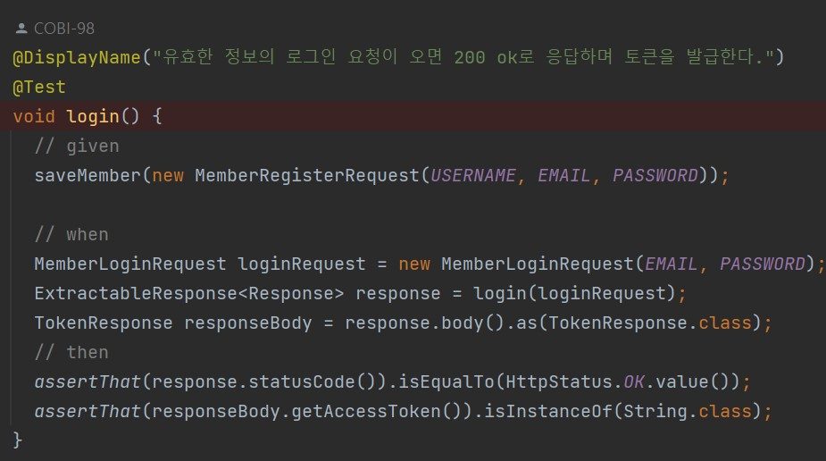
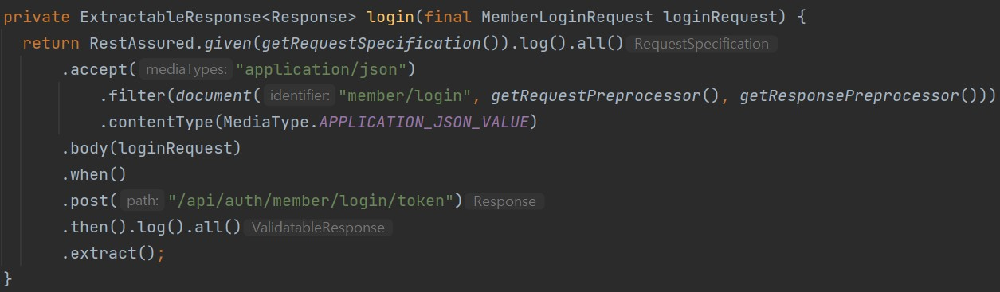
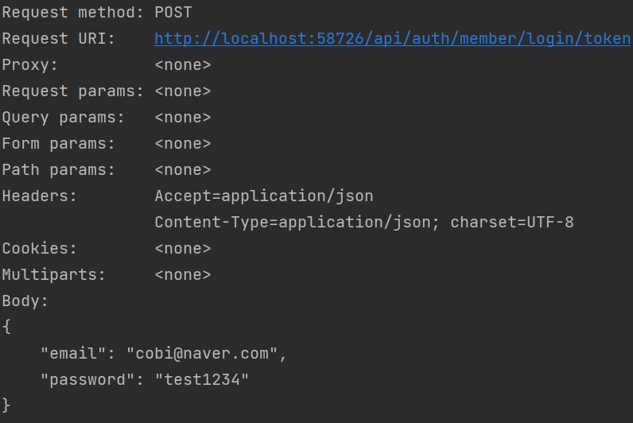
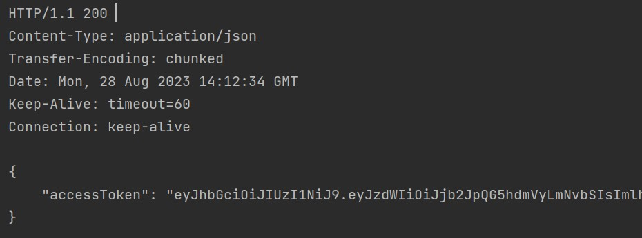

# Rest-Assured 알아보기

REST-Assured는 Java 기반의 오픈 소스 라이브러리로, RESTful API를 테스트하고 검증하는데 사용된다.

 API 테스트를 더욱 효과적으로 작성하고 관리하기 위해 설계되었으며,   
 REST-Assured를 사용하면 HTTP 요청 및 응답을 쉽게 작성하고 검증할 수 있다.

 

## 등장배경
기존의 테스트 프레임워크들은 API 테스트를 작성하는 것에 있어서   
`RESTful API의 HTTP 요청 및 응답`을 쉽게 작성하고 검증하는 것이 어려웠다.  

REST-Assured는 간편하게 HTTP 요청을 작성하고 응답을 검증하는 기능을 제공하여 API 테스트를 효율적으로 작성할 수 있도록 도와준다.

또한 단위 테스트, 통합 테스트로 개발자의 안심을 이끌어 낼 수 있지만, 이는 내부 개발자의 관점이다.

Rest-Assured는 외부 사용자의 관점에서 코드에 상관없이 요청과 응답으로 REST API 자동화 테스트를 구성하고 확인할 수 있어서, 사용자의 관점에서 한번 더 안심할 수 있다.

 

## 동작원리
- REST-Assured는 기본적으로 Given-When-Then 구조를 사용하여 테스트를 작성
- given()은 요청을 준비하고,   when()은 실제 요청을 수행하며,   then()은 응답을 검증한다.

 

## 장,단점
장점
- Given-When-Then 구조를 사용하여 테스트를 작성하므로 읽기 쉽고 이해하기 쉽다.
- 간단한 메서드 체이닝을 통해 HTTP 요청 및 응답을 쉽게 작성하고 검증할 수 있다.
- 응답된 JSON, XML를 손쉽게 검증할 수 있다. (여기선 JSON 기준으로 진행한다.)
- 블랙박스 테스트로 오로지 Request(요청)와 Response(응답)로 결과를 확인한다.

단점
- 테스트가 많아질수록 코드의 복잡성이 증가
- 테스트 환경을 설정하는 데에 일정한 작업이 필요

 

## Spring 적용 예시

다음은 로그인 요청 관련 토큰 발급 테스트이다.
코드를 살펴보자.

  
  

**given() 절**에서는 어떠한 Http Request를 보내줄지 지정해주며,

**when()절**에서는 이제 어떠한 uri의 api를 호출할 것인지 지정해준다.

when().post(uri), when().get(uri), when().put(uri) 등등이 될 수 있다.

**then()절**에서는 결과를 리턴해준다. 

extract()를 해주면 response를 얻을 수 있고, 여기에는 statusCode (200, 201, 400, 500 등)와 header, jsonpath 등이 존재한다.

given() 절과 then() 절에서 .log().all()를 붙일 경우, 콘솔창에서 http log를 확인해줄 수 있다.

  
  

assertThat으로 200 Created가 잘 보내졌는지,  토큰의 실제 객체 타입이 String으로 잘 변환되는지 확인할 수 있다.

 

## 정리

기존에 사용했던 MockMvc 패턴을   RestAssured 라이브러리를 사용하며 BDD 스타일로 변경시키니 
가독성 면에서 장점을 가지고 있다는 것을 확인했다.

뿐만 아니라 RestAssured를 다양한 형태로 추출하고 사용되면서 HTTP 요청 및 응답을 쉽게 작성하는 것 같다.

 

## reference
[REST-Assured 알아보기](https://loopstudy.tistory.com/427#Specifying%--Request%--Data%--%EC%-A%--%EC%B-%AD%--%EC%--%AC%EC%--%--%--%EB%-D%B-%EC%-D%B-%ED%--%B-%--%EC%--%B-%ED%-C%--%ED%--%--%EA%B-%B-)

[[Spring][TDD] RestAssured를 이용한 e2e test로 Controller API까지 통합 테스트해보자](https://kth990303.tistory.com/315)

