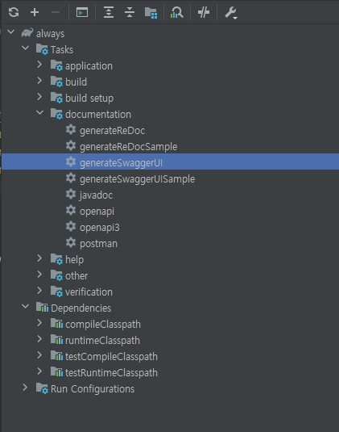

# SwaggerUI + Spring REST Docs 함께 사용하기

## SwaggerUI VS Spring REST Docs
팀 프로젝트 스택 결정시 API 문서화를 도와주는 프레임워크에 Spring Rest Docs와 Swagger가 언급되었고, 두 가지 스택 중 한 스택을 결정하기로 하였다. <br> 다음은 어떤 스택을 사용할지에 대해 서로 공부해서 소통하기로 한 결과를 표로 정리한 내용이다.


| 주요 특징                  | Spring Rest Docs                                     | Swagger                                               |
|---------------------------|---------------------------------------------------|-------------------------------------------------------|
| 주 용 도               | 테스트 기반 API 문서화                            | API 스펙 정의 및 시각적 문서화                        |
| 문서화 방식             | 테스트 케이스를 사용하여 API를 호출하고 문서화 | API 스펙을 정의하고 자동으로 시각적 문서를 생성       |
| 테스트 기반 문서화     | 예 (JUnit, REST Assured, MockMvc 등을 사용)     | 아니요                                                  |
| 문서 형식                | 다양한 형식을 지원 (HTML, Asciidoctor, 등)       | JSON 또는 YAML 형식으로 API 스펙을 제공              |
| 정확성                    | 실제 API 동작을 기반으로 문서 생성                | 스펙 정의에 따라 문서 생성                           |

핵심적으로 Swagger 프레임워크를 사용할 시,
- Swagger의 시각적 문서화의 장점
- Swagger를 통한 빠른 개발

Spring REST Docs 프레임 워크 사용 시,

- Spring REST Docs는 테스트 케이스를 통해 API 엔드포인트를 호출하고 응답을 문서화 
- API의 실제 동작을 문서화하며, 실제 동작과 문서 간의 불일치를 방지

서로간의 장점이 명확하여 의견이 좁혀지지 않았지만, 두 가지 장점을 합친 [이 글](https://jwkim96.tistory.com/274)을 발견하였다.

해당 글은 swagger + restdocs를 함께 사용할 수 있는 글이었고, <br>
이를 통해 Swagger로 초기단계에 개발자와 클라이언트 팀 간의 원활한 의사 소통과 <br>
RestDocs로 작성하여 API 문서를 정확하게 유지할 수 있는 swaggerUI + rest docs 의 조합을 사용하기로 결정하였다.

<br>

## SwaggerUI + Spring REST Docs flow
<p>
  
</p>

두 스택을 사용할 수 있는 flow에는 다음과 같은 핵심 플러그인이 존재한다.

- com.epages.restdocs-api-spec

  - Spring REST Docs 의 결과물을 OpenAPI 3 스펙으로 변환
- org.hidetake.swagger.generator

  - OpenAPI 3 스펙을 기반으로 SwaggerUI 생성(HTML, CSS, JS)

이 플러그인을 사용해서 Spring REST Docs 실행 결과를 OpenAPI 3 스펙을 출력하게 하고, 이를 이용해 SwaggerUI 를 생성하는 방식으로 동작하는 방식인 것이다.

여기서 restdocs-api-spec의 MockMvc 와 RestAssured의 차이가 존재하는데 이는 다음과 같다.

<br>

### **@AuthenticationPrincipal을 사용하는 방법 (MockMvc)**

장점:
- Spring Security와의 통합이 쉽다. 
- MockMvc는 Spring Security를 지원하며, @AuthenticationPrincipal로 주입된 사용자 정보를 쉽게 사용할 수 있다.
- 테스트 코드가 좀 더 실제 요청과 유사하다.

단점:
- Spring REST Docs와 함께 사용할 때 인증 정보 주입이 복잡할 수 있다.


### **헤더를 통해 인증 토큰으로 유저 정보를 받는 방법 (Rest Assured(this.spec))**

장점:
- Spring REST Docs와 통합하기 쉽다. 
- HTTP 요청을 직접 보내지 않으므로 문서화와 관련된 작업을 분리하기 쉽다.
- 인증 정보를 토큰으로 전달하면 API 클라이언트와 더 일관적이게 작동할 수 있습니다.

단점:
- 테스트 코드에서 인증 및 보안 설정을 처리해야 합니다.
- MockMvc와 Spring Security를 사용하는 것보다 복잡할 수 있다.

<br>
우리는 Spring Security의 Oauth2.0 과 jwt방식을 사용하고 있기 때문에, <br>
 Spring Security와의 통합과 실제 요청과 비슷한 테스트코드 작성에 장점을 가지고있는 MockMvc를 결정하기로 하였다.

<br>

<p>
    
</p>

<br>

## swagger + restdocs 도입

## openapi3
### build.gradle
```gradle
buildscript {
  ext {
      restdocsApiSpecVersion = '0.16.2'
  }
}

plugins {

    /..

	id 'com.epages.restdocs-api-spec' version "${restdocsApiSpecVersion}"

}

openapi3 {
	setServer("http://localhost:8080")
	title = "Al-ways API 문서"
	description = "Spring REST Docs with SwaggerUI."
	version = "0.0.1"
	format = "yaml"
}

dependencies {

  // Rest Docs
	asciidoctorExt 'org.springframework.restdocs:spring-restdocs-asciidoctor:{project-version}' 
	testImplementation 'org.springframework.restdocs:spring-restdocs-mockmvc:{project-version}' 
}

```
추가한 설정에 대한 정보가 필요하다면 [스프링 공식문서](https://docs.spring.io/spring-restdocs/docs/current/reference/htmlsingle/#getting-started) 를 참조하기를 바란다.

<br>

### API 및 테스트 코드

- API 코드 (사용자 이름 수정)
```java
@RestController
@RequestMapping("/api/oauth2")
@RequiredArgsConstructor
public class OauthControllerApi {

    private final UserService userService;

    @PutMapping("/user/name")
    public ResponseEntity<SuccessResponse> modifyName(
            @AuthenticationPrincipal UserPrincipal userPrincipal,
            @RequestBody @Valid UserNameRequestDto userNameuserNameRequestDto) {

        userService.modifyName(userPrincipal.getUser().getId(), userNameuserNameRequestDto);

        return ResponseEntity.ok(
                SuccessResponse.builder()
                        .message("member.modifyName.success")
                        .data("data")
                        .build());
    }
}

- Test 코드 작성(AcceptanceTest.java)
```java
@ExtendWith(RestDocumentationExtension.class)
public class AcceptanceTest {

    protected static final String DEFAULT_RESTDOC_PATH = "{class_name}/{method_name}/";

    @Autowired
    protected MockMvc mockMvc;

    @BeforeEach
    void setUp(
            final WebApplicationContext context,
            final RestDocumentationContextProvider restDocumentation) {
        this.mockMvc = MockMvcBuilders.webAppContextSetup(context)
                .apply(documentationConfiguration(restDocumentation)
                        .operationPreprocessors()
                        .withRequestDefaults(prettyPrint())
                        .withResponseDefaults(prettyPrint())
                )
                .alwaysDo(MockMvcResultHandlers.print())
                .addFilters(new CharacterEncodingFilter("UTF-8", true))
                .build();
    }
}
```

- 테스트 코드 작성(OauthControllerApiTest.java)
```java
@SpringBootTest
@AutoConfigureMockMvc
class OauthControllerApiTest extends AcceptanceTest {

    private static final String BEARER_TYPE = "Bearer ";
    
    @Autowired
    ObjectMapper objectMapper;

    @Test
    @DisplayName("사용자 이름 변경")
    @WithMockOAuth2User
    void modifyName() throws Exception {

        // given
        UserNameRequestDto dto = UserNameRequestDto.builder()
                .name("김철수").build();

        // when
        ResultActions result = mockMvc.perform(put("/api/oauth2/user/name")
                .header(HttpHeaders.AUTHORIZATION, BEARER_TYPE + "ACCESS_TOKEN")
                .content(objectMapper.writeValueAsString(dto))
                .contentType(MediaType.APPLICATION_JSON)
        );

        // then
        result.andExpect(status().isOk())
                .andDo(document(DEFAULT_RESTDOC_PATH,
                        requestHeaders(
                                headerWithName(HttpHeaders.AUTHORIZATION).description("액세스 토큰")
                        ),
                        requestFields(
                                fieldWithPath("name").type(JsonFieldType.STRING).description("사용자 이름")
                        ),
                        responseFields(
                                fieldWithPath("status").type(JsonFieldType.NUMBER).description("응답 상태 코드"),
                                fieldWithPath("message").type(JsonFieldType.STRING).description("응답 메시지"),
                                fieldWithPath("data").type(JsonFieldType.STRING).description("응답 데이터")
                        )
                ));
    }
}
```

<br>

### 문서 생성 확인
<p>
  
  
</p>
<br>

## swaggerUI 
### gradle 추가
```gradle
import org.hidetake.gradle.swagger.generator.GenerateSwaggerUI
import org.springframework.boot.gradle.tasks.bundling.BootJar

plugins {
	// swagger generator 플러그인 추가
	id 'org.hidetake.swagger.generator' version '2.18.2'
}


// swaggerSources 설정 추가
swaggerSources {
	sample {
		setInputFile(file("${project.buildDir}/api-spec/openapi3.yaml"))
	}
}

dependencies {
	// Swagger 의존성 추가
  swaggerUI 'org.webjars:swagger-ui:4.11.1'
}

// GenerateSwaggerUI 태스크가, openapi3 task 를 의존하도록 설정
tasks.withType(GenerateSwaggerUI) {
	dependsOn 'openapi3'
}

// 생성된 SwaggerUI 를 jar 에 포함시키기 위해 build/resources 경로로 로 복사
tasks.register('copySwaggerUI', Copy) {
	dependsOn 'generateSwaggerUISample'

	def generateSwaggerUISampleTask = tasks.named('generateSwaggerUISample', GenerateSwaggerUI).get()

	from("${generateSwaggerUISampleTask.outputDir}")
	into("${project.buildDir}/resources/main/static/docs")
}

// bootJar 실행 전, copySwaggerUI 를 실행하도록 설정
tasks.withType(BootJar) {
	dependsOn 'copySwaggerUI'
}
```

### SwaggerUI 연동 
build/swagger-ui-sample 에 생성된 SwaggerUI 가 build/resources/main/static/docs 로 잘 복사되며, <br> index 파일에 UI를 확인할 수 있다.
<p>
  
  
</p>
<br>


<br>

## 결과

<p>
  
</p>


<br>

## 정리
Swagger와 Spring REST Docs의 조합은 <br>
 개발자와 API 사용자 간의 원활한 의사 소통과 협력을 촉진하며(Swagger)<br> 정확하고 이해하기 쉬운 API 문서를 생성(RestDocs)하는 데 도움을 줄것이다. 
 
 API를 개발하고 관리하는 프로세스를 향상시키는 데 도움이 될 것 같다.
 
## reference
[SwaggerUI + Spring REST Docs 함께 사용하기(feat. Rest Assured)](https://jwkim96.tistory.com/274)
