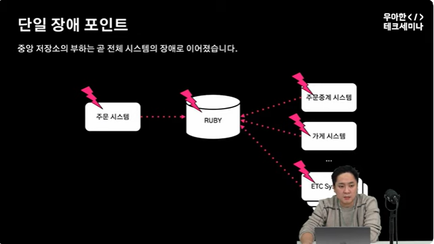
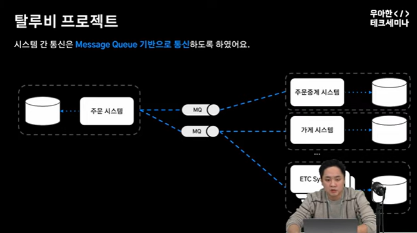
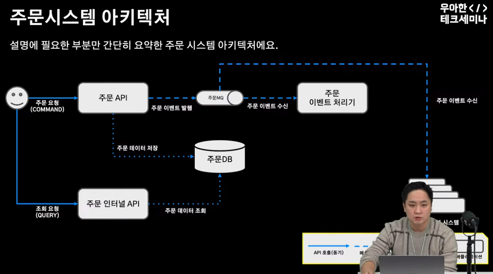
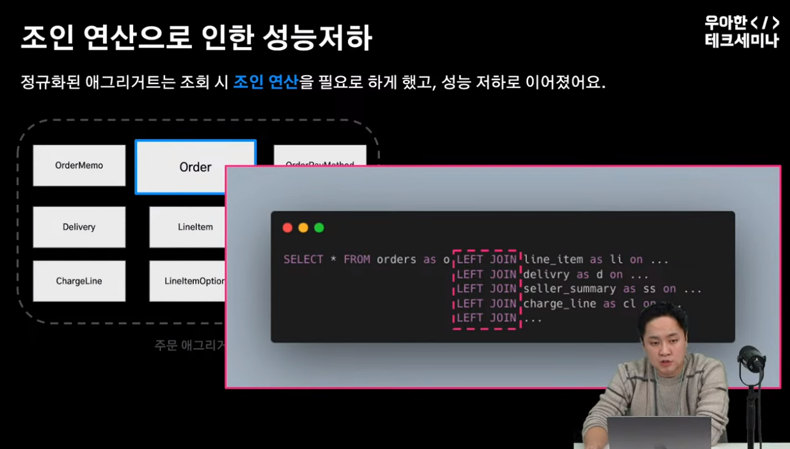
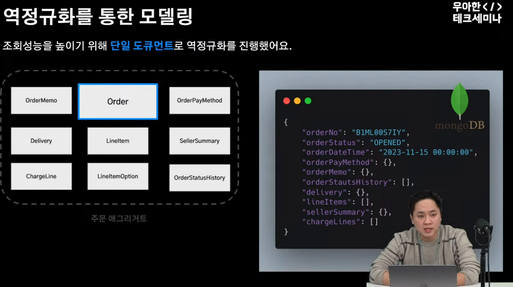
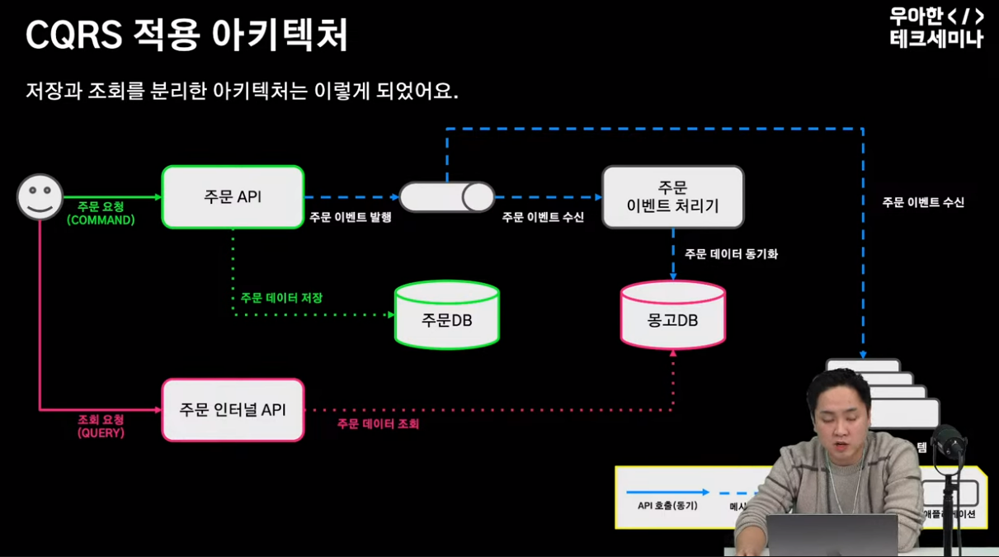
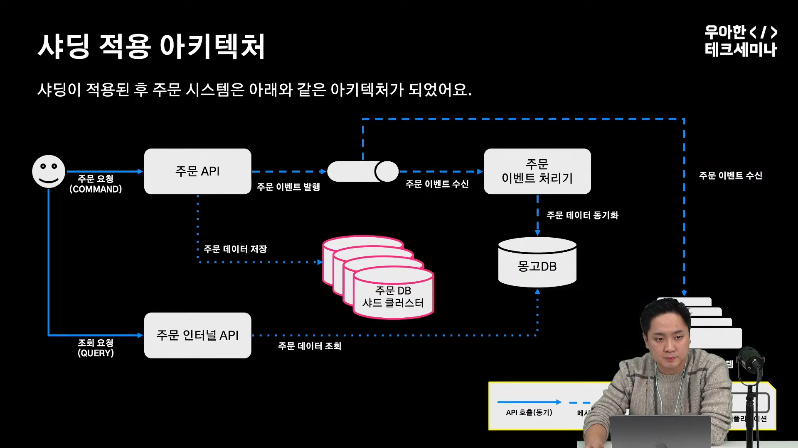
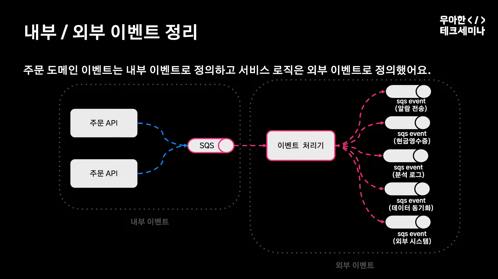
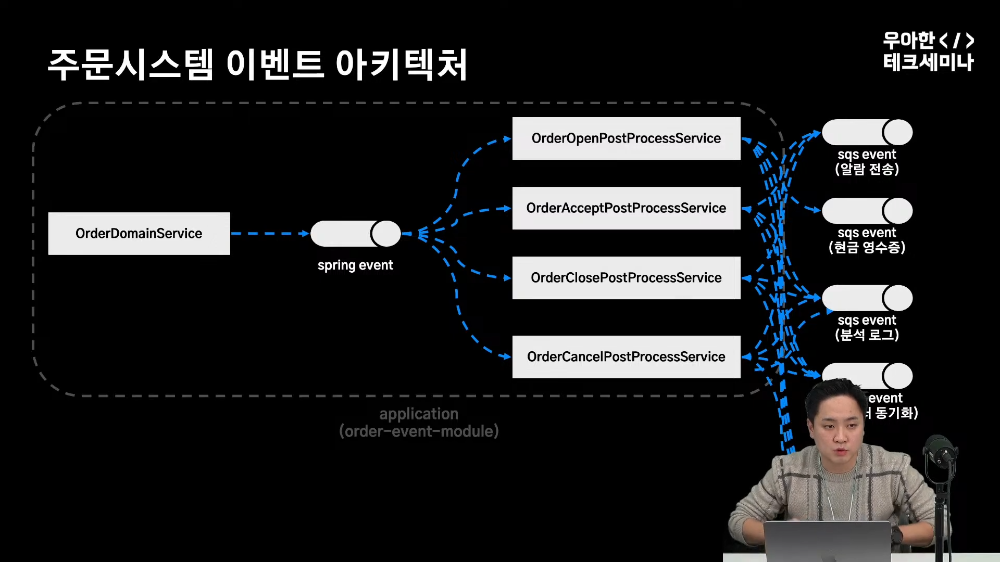
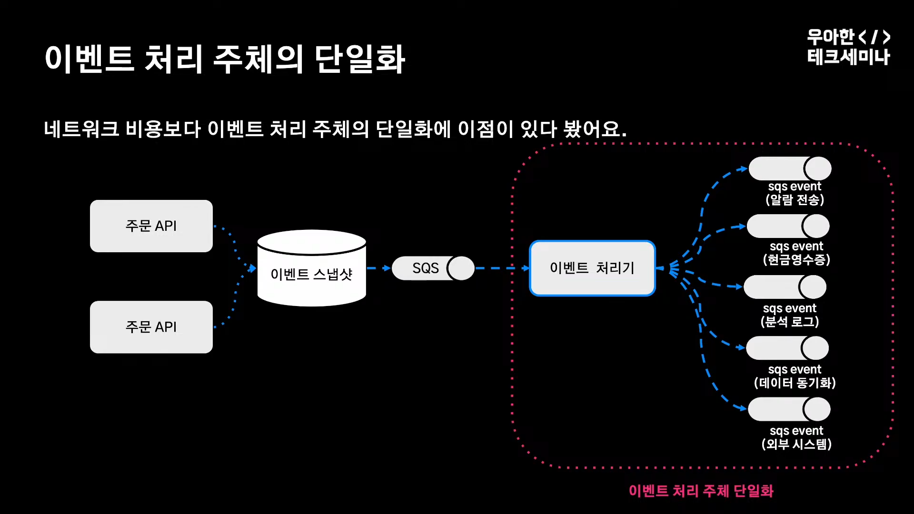

# 대규모 트랜잭션을 처리하는 배민 주문시스템 세션 후기

## **배달의민족 주문 시스템**

특정 시간에 주문율이 높은 커머스와 수많은 시스템의 존재하는 시스템
- 느슨한 결합이 중요

방대한 데이터를 어떻게 저장해야할까?
- 조회 성능 고려

대규모 트랜잭션
- CQRS 및 애그리게이트 이슈 해결

다양한 이벤트 기간으로의 통신
- 이벤트 아키텍쳐 단순화, 일관성 유지

 

## **성장하는 배민 주문 시스템**

### **성장통**

- **단일 장애 포인트**
    - `하나의 시스템의 장애는 전체 시스템의 장애로 이어졌어요.`

**RUBY 라는 중앙 저장소를 사용, 이는 단일 장애 포인트가 됨. MSA 를 통한 탈중앙 을 시도**

  
  

> 특정시스템의 장애는 메시지 발행으로 끝이나며,  
시스템이 복구되면 이벤트를 재발행하도록 변경

 

- **대용량 데이터**
  - `RDBMS 조인 연산으로 조회 성능이 좋지 않았어요.`

 

  
  

 

1. **정규화된 애그리거트의 조인 연산 -> 성능 저하** 

조회 성능을 높이기 위해 단일 도큐먼트로 역정규화를 진행

2. **데이터 동기화** 

주문 이벤트 처리기에서 진행 후 몽고 DB에 동기화  
- **CQRS 아키텍처 적용**

`애그리거트란?`
>애그리거트 객체 간의 관계를 정의하는 방법 중 하나로,   논리적으로 관련된 객체들을 그룹화하여 하나의 묶음

  
  

 

- **대규모 트랜잭션**
    - `주문수 증가로 저장소의 쓰기 처리량 한계에 도달했어요.`

쓰기 DB 스케일 업 최대한으로 했지만, 감당하기 어려워짐
- 샤딩 하기로 결정 (DB 트래픽을 분산 및 저장)
- 문제 : aws 오로라는 샤딩을 지원하지 않음 
- **애플리케이션 샤딩으로 진행하기로 결정**

애플리케이션 sharding, 대표적인 3가지 방식

**key based**  
e.g. 주문 번호를 기준으로 샤딩  

**range based**  
e.g. 주문 금액을 기준으로 샤딩  

**directory based**  
lookup table 사용  

최종적으로 key based로 처리, Spring 의 AOP 설정 통해서 진행

다건 조회시 데이터 애그리게이트 이슈(샤드에 분산된 데이터를 어떻게 한번에 보내줄 것인가?)
- 다건 조회시에는 몽고DB 활용하여 해결. CQRS를 적용해둔것이 샤딩 적용시 도움이 됨.

> 샤딩으로 인해 쓰기 요청 증가를 스케일 아웃으로 대응이 가능 

 

- **복잡한 이벤트 아키텍처**
    - `규칙 없는 이벤트 발행으로 서비스 복잡도가 높아졌어요.`

**내부 이벤트와 외부 이벤트 분리 및 정리**

**내부 이벤트는 스프링 이벤트를 기반으로 서비스 분리,** 
**외부 이벤트는 SQS를 기반으로 이벤트 처리 주체 단일화**

  
  

 

## reference
[[우아한테크세미나] 1부: 대규모 트랜잭션을 처리하는 배민 주문시스템 규모에 따른 진화](https://www.youtube.com/watch?time_continue=2321&v=WCwPSVu8mH8&embeds_referring_euri=https%3A%2F%2Fjonghoonpark.com%2F&source_ve_path=MTM5MTE3LDIzODUx&feature=emb_title)

[DB분산처리를 위한 sharding](https://techblog.woowahan.com/2687/)

 

## 정리
[이커머스 도메인 지식이 왜 필요해?](https://brunch.co.kr/@windydog/371)

[이커머스 도메인의 필수 지식](https://www.mobiinside.co.kr/2022/11/04/ecommerce-domain/)

[DDD 애그리거트](https://incheol-jung.gitbook.io/docs/study/ddd-start/3)

[AWS 샤딩](https://aws.amazon.com/ko/what-is/database-sharding/)